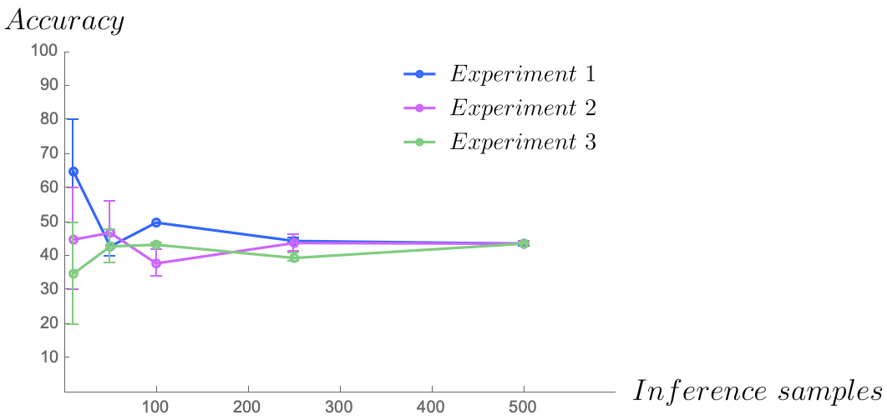
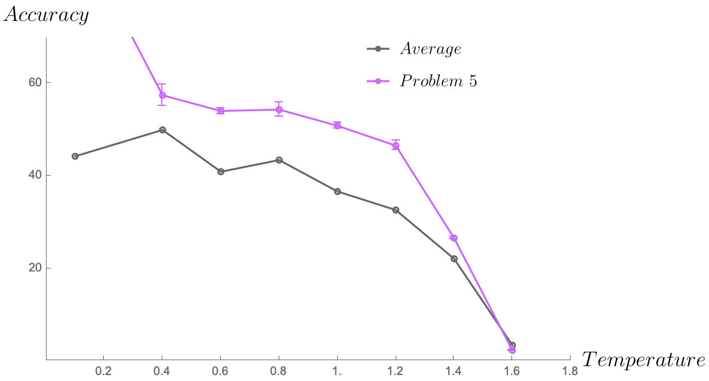
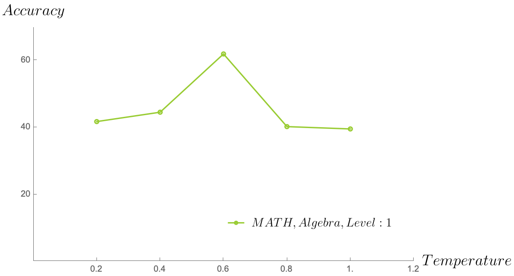

# Inference experiments with large language models

## The effect of temperature
The importance of statistical approaches to the study of large language models has been emphasized recently by the AI experts at [Antropic](https://www.anthropic.com/research/statistical-approach-to-model-evals). Large language models are usually stochastic - given a fixed prompt it generates different inference time responses each time due to non-zero temperature. This property is helpful in increasing creativity during language generation tasks. However, it is not clear how a non-zero temperature helps in solving precise mathematical problems. To understand this better we set up simple statistical experiments in this repo. The experiments are performed using [vLLM](https://docs.vllm.ai/en/latest/) on [MATH](https://paperswithcode.com/dataset/math) dataset.

### [Llama 8B](https://ai.meta.com/blog/meta-llama-3/)

The experiment is done with max_tokens = 1024, num_few_shot = 2, top_p = 0.95,  temperature = 0.6 on Llama 8B on a randomly chosen problem 5: "What is the 100th term of the arithmetic sequence 6, 10, 14, 18, ...?" We clearly see that there is a large variation to the response for a small number of inference samples. An earlier notable study on such questions is by [Matthew Renze and Erhan Guven](https://arxiv.org/pdf/2402.05201v1), in their work, 10 inference samples are considered for each problem. Given our results above it is clear that such results are not reliable. To overcome this difficulty we choose 1000 inference samples at each value of temperature and plot the mean accuracy below:

We clearly see that with an increase in temperature, the accuracy drops significantly for problem 5. On the other hand, for the average over MATH dataset we see an initial oscillation and then a decrease in accuracy as we increase temperature. This initial oscillation suggests there might be an interesting dependence of accuracy on the difficulty of the problem - for example, problems of a certain type might show an increase in accuracy as temperature is increased initially. To understand this phenomenon better we set up experiments on a further refined MATH dataset consisting of only algebra level 1 problems on Gemma 7B. 

### [Gemma 7B](https://ai.google.dev/gemma)

To our surprise, we find that there is a critical temperature at which accuracy attens to a local maxima. We would like to emphasize that we have increased our inference samples significantly, reducing the variance to a negligible value for a given problem. However, when we look across problems, variance also receives a contribution from the dataset size. Notably, the MATH dataset contains only 273 algebra, level 1 problems, on which we have experimented above. To have a more statistically robust prediction in the future, we need to have access to a much bigger dataset.

